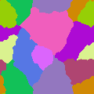

# simple-grain-growth-algorithm
Naive grain growth algorithm with simple GUI.

## Table of Contents
* [General info](#general-info)
* [Technologies](#technologies)
* [GUI description](#gui-description)
* [Examples of simulation](#examples-of-simulation)

## General info
The subject of the project was the simulation of grain growth and the modeling of the obtained microstructure using various options and strategies.

## Technologies
The program is created with:
* Java 11
* JavaFX 11.0.2

## GUI description

<i>Image 1. GUI of the program with marked buttons</i>

Button | Function
------ | -------------
1a | file menu which contains options to export given simulation or to import previous simulations
1b | field containing the number of cells in the X dimension
1c | field containing the number of cells in the Y dimension
1d | field containing the number of initial grains
1e | radio buttons for selecting the type of boundary conditions
1f | field containing the number of inclusions to be added
1g | field containing the size of inclusions to be added
1h | radio buttons for selecting the type of inclusions to be added
1i | button adding inclusions to microstructure after finished growth
1j | radio buttons for selecting the type of grain growth (simple growth or with curvature)
1k | field containing the probability of changing state by the cell in the growth with curvature (this field is ignored in the simple growth)
1l | checkbox containing information if the simulation should start with inclusions (if should start with initial inclusions it should be checked)
1m | button for starting simulation based on options from fields 1b | 1l
1n | number of new initial grains in each grain during creating substructures
1o | after clicking this button user has possibility to choose grains (by clicking on them) to become the second phase which will be immutable during growth of the substructures
1u | button for starting growth of the substructures based on option from field 1n
1p | slider for selecting thickness of boundaries (available are three values: 2px, 4px, 6px)
1r | button for showing boundaries of all grains or particular grain (if it has been selected using 1s button) with thickness based on option from slider 1p. After showing boundaries it allows to actualize thickness of given boundaries based on values from slider 1p
1s | after clicking this button user has possibility to choose one particular grain (by clicking on it) which’s boundaries will be show with thickness based on option from slider 1p
1t | button for clearing colors of grains and to remain only already generated (by button 1r or 1s) boundaries

## Examples of simulation
                  | 
--------------------------------------------|------------------------------------------------------------------
*Image 2. Structure after simple grain growth with absorbing boundary conditions*                               | *Image 3. Structure after simple grain growth with periodic boundary conditions*

                  | 
--------------------------------------------|------------------------------------------------------------------
*Image 4. Structure after simple grain growth with absorbing boundary conditions and initial circle inclusions* | *Image 5. Structure after simple grain growth with periodic boundary conditions and circle inclusions added after grain growth*

                  | 
--------------------------------------------|------------------------------------------------------------------
*Image 6. Structure after simple grain growth with absorbing boundary conditions and initial square inclusions* | *Image 7. Structure after simple grain growth with absorbing boundary conditions and square inclusions added after grain growth*

                  | 
--------------------------------------------|------------------------------------------------------------------
*Image 8. Structure after grain growth with curvature and absorbing boundary conditions*                        | *Image 9. Structure after grain growth with curvature and periodic boundary conditions *

                 | 
--------------------------------------------|------------------------------------------------------------------
*Image 10. Structure after grain growth and after substructures growth*                                         | *Image 11. Structure after grain growth and after substructures growth with second phase (phase with magenta color)*

                 | 
--------------------------------------------|------------------------------------------------------------------
*Image 12. Structure after grain growth and after substructures growth with marked 2px boundaries*              | *Image 13. Structure after grain growth and after substructures growth with marked 4px boundaries*

                 | 
--------------------------------------------|------------------------------------------------------------------
*Image 14. Structure after grain growth and after substructures growth with marked 6px boundaries*              |   *Image 15. Grains boundaries (2px) after grain growth and after substructures growth*

                 | 
--------------------------------------------|------------------------------------------------------------------
*Image 16. Boundaries of particular grain and microstructure after grain growth and after substructures growth* | *Image 17. Boundaries of particular grain after grain growth and after substructures growth*
